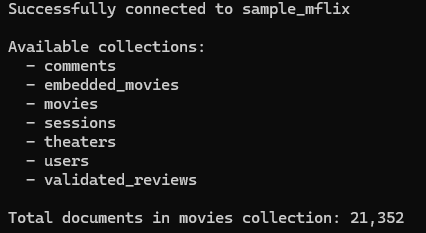
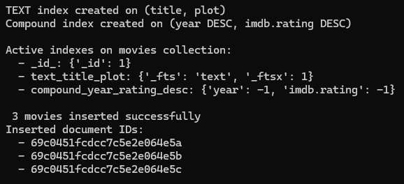
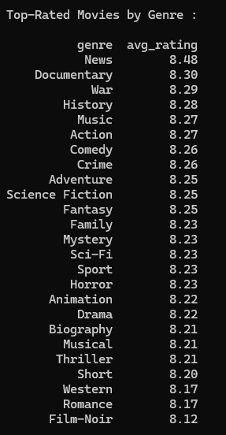
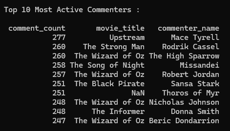
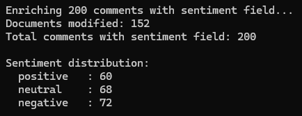
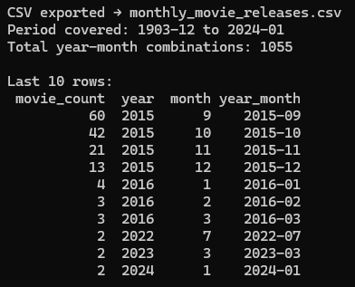
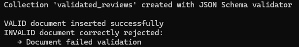
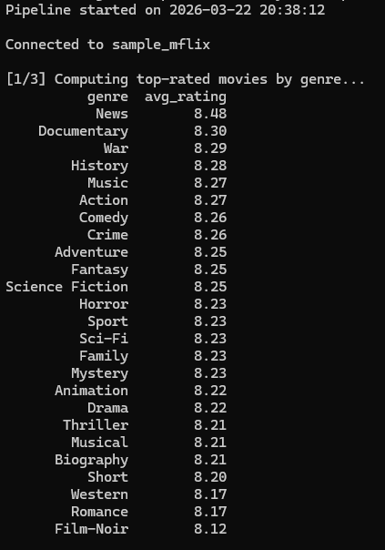
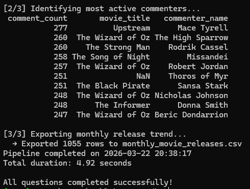

# Lab 2 — MongoDB with Python (PyMongo)


## Overview
End-to-end data engineering analytics pipeline built on the MongoDB
`sample_mflix` dataset using PyMongo and Pandas. Covers indexing,
aggregation pipelines, data enrichment, schema validation, and CSV export.

---

## Pipeline Architecture
```
MongoDB Atlas (sample_mflix)
         ↓
MongoDB Compass (visual inspection)
         ↓
┌─────────────────────────────────┐
│  Q1 → Index Creation            │
│  Q2 → Data Ingestion            │
│  Q3 → Genre Aggregation         │
│  Q4 → $lookup + Commenters      │
│  Q5 → Bulk Data Enrichment      │
│  Q6 → CSV Export                │
│  Q7 → JSON Schema Validation    │
│  Q8 → Reusable Pipeline Fn      │
└─────────────────────────────────┘
         ↓
  Pandas DataFrames + CSV Output
```

---

## Dataset
MongoDB Atlas sample dataset — `sample_mflix`

| Collection | Description |
|---|---|
| `movies` | 21,349 movie documents |
| `comments` | User comments on movies |
| `users` | Platform user accounts |
| `theaters` | Theater locations |
| `sessions` | User sessions |

---

## What this lab covers

| # | Topic | Key Concepts |
|---|---|---|
| Q1 | Connection & Indexing | TEXT index, compound index |
| Q2 | Data Ingestion | `insert_many()`, BSON Date |
| Q3 | Aggregation Pipeline | `$match`, `$unwind`, `$group`, `$slice` |
| Q4 | Advanced Analytics | `$lookup`, `$first`, `$sum` |
| Q5 | Data Enrichment | `bulk_write()`, `$set` |
| Q6 | Analytics Export | `$year`, `$month`, CSV export |
| Q7 | Schema Validation | JSON Schema, `validationAction` |
| Q8 | Pipeline Function | Reusable orchestration |

---

## Output Preview

### Q1 — Connection & Collections


### Q2 — Index Creation


### Q3 — Top-Rated Movies by Genre


### Q4 — Most Active Commenters


### Q5 — Sentiment Enrichment


### Q6 — CSV Export


### Q7 — Schema Validation


### Q8 — Final Pipeline Function



---

## MongoDB Atlas Setup

### 1. Create a free cluster
1. Go to [mongodb.com/atlas](https://www.mongodb.com/atlas)
2. Click **"Try Free"** and create an account
3. Create a new cluster → choose **Cluster0 Free**
4. Choose any provider and region closest to you

### 2. Configure access
1. **Database User** → create a username and password
2. **Network Access** → click "Add IP Address" → "Allow Access From Anywhere" (`0.0.0.0/0`)

### 3. Load sample dataset
1. In your cluster → click **"..."** → **"Load Sample Dataset"**
2. Wait 3-5 minutes
3. Click **"Browse Collections"** → verify `sample_mflix` is loaded

### 4. Get your MONGO_URI

**Method 1 — Via Drivers (for Python script)**
1. Click **"Connect"** on your cluster
2. Choose **"Drivers"** → Python → 3.12 or later
3. Copy the connection string:
```
mongodb+srv://<username>:<password>@cluster0.xxxxx.mongodb.net/?retryWrites=true&w=majority&appName=Cluster0
```
4. Replace `<password>` with your actual password
5. Paste it in your `.env` file as `MONGO_URI=...`

**Method 2 — Via MongoDB Compass (for visual inspection)**
1. Click **"Connect"** on your cluster
2. Choose **"Compass"**
3. Select **"I have MongoDB Compass installed"**
4. Copy the connection string shown
5. Open MongoDB Compass → paste the string → click **"Connect"**
6. You can now browse collections visually alongside running the script

---

## Project Structure
```
lab2_mongodb/
├── mflix_pipeline_answers.py        ← main script 
├── requirements.txt                 ← Python dependencies
├── README.md                        ← project documentation
├── NOTES.md                         ← technical decisions & design choices
├── .gitignore                       ← git ignore rules
├── screenshots/                     ← output previews
│   ├── 01_connection.png
│   ├── 02_indexes.png
│   ├── 03_genres.png
│   ├── 04_commenters.png
│   ├── 05_sentiment.png
│   ├── 06_csv.png
│   ├── 07_validation.png
│   ├── 08_pipeline_final_part1.png
│   └── 08_pipeline_final_part2.png
└── .env                             ← NOT pushed (credentials)
```

---

## Setup

### 1. Clone the repository
```bash
git clone https://github.com/ouhaddousara/Lab2_mongoDB.git
cd Lab2_mongoDB
```

### 2. Create virtual environment
```bash
python -m venv venv

# Windows
venv\Scripts\activate

# Mac/Linux
source venv/bin/activate
```

### 3. Install dependencies
```bash
pip install -r requirements.txt
```

### 4. Configure environment
Create a `.env` file in the root directory:
```
MONGO_URI=mongodb+srv://<username>:<password>@cluster0.xxxxx.mongodb.net/?retryWrites=true&w=majority&appName=Cluster0
```

### 5. Run the script
```bash
python mflix_pipeline_answers.py
```

---

## Expected Output
- Collections listed in terminal
- TEXT + compound indexes created on `movies`
- 3 new movies inserted with generated ObjectIds
- Top-rated movies by genre displayed as DataFrame
- Top 10 commenters displayed as DataFrame
- `monthly_movie_releases.csv` exported
- Schema validation tested (valid ✅ + invalid ❌)
- Full pipeline executed with timing

---

## Requirements
- Python 3.13+
- MongoDB Atlas account with `sample_mflix` loaded
- See `requirements.txt` for Python dependencies

---

## Author
**Sara Ouhaddou** — Data Engineering Lab, 2026
